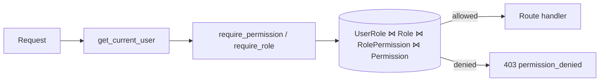
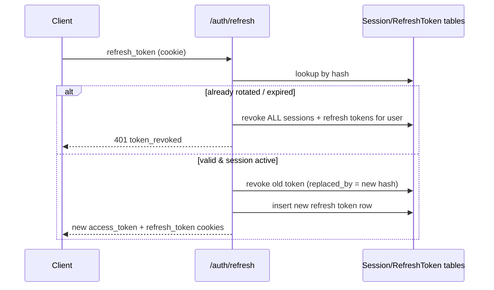

# SalesPilot AI — Authentication & Authorization System

This document covers the auth/RBAC layer implemented on top of the existing
database schema (see `app/models/ARCHITECTURE.md` and `ERD.md`). It does not
redesign anything there — it explains the flows and decisions specific to
`app/auth`, `app/security`, `app/services`, `app/repositories`, and
`app/api/v1/auth.py` / `organizations.py`.

---

## 1. Authentication Flow

### Register

```
POST /api/v1/auth/register
{ email, password, first_name, last_name, organization_name }
```

1. `AuthService.register` checks the email isn't taken, then delegates to
   `OrganizationService.create_with_owner_role`, which:
   - creates the `Organization` row (slug auto-generated from the name,
     deduplicated with a numeric suffix if needed),
   - seeds all six system `Role` rows (owner/admin/manager/sales/member/viewer)
     for that organization from `app/security/permissions.py`'s
     `DEFAULT_ROLE_PERMISSIONS`, creating/reusing global `Permission` rows.
2. The `User` row is created with `status=pending_verification`, assigned the
   `owner` role.
3. An email verification token is generated (opaque, hashed at rest — see
   §6). No email is sent (out of scope per the brief); in non-production
   environments the raw token is returned in the response's `meta` block
   under `debug_email_verification_token` so the flow is testable end to end
   without an email provider.
4. The route then calls `SessionService.issue_token_pair` to log the new
   owner in immediately (session + access/refresh tokens + cookies) — see
   §3.

### Login

```
POST /api/v1/auth/login
{ email, password, remember_me }
```

`AuthService.authenticate`:
1. Checks the per-IP login rate limit (`app/security/rate_limit.py`).
2. Looks up the user by email. An unknown email and a wrong password return
   the *identical* `invalid_credentials` error — the API never reveals
   whether an email is registered.
3. Checks the Redis-backed account lockout counter (§6).
4. Rejects `suspended` / `disabled` / `deleted` / `inactive` accounts with a
   distinct `AccountSuspendedError` (still generic enough not to leak
   details to an unauthenticated caller beyond "this account can't log in").
   `pending_verification` and `active` may both log in — email verification
   is enforced per-route via `require_verified_email`, not at login time.
5. On success: clears the lockout counter, stamps `last_login_at`, writes a
   `LOGIN` audit log row, and issues a token pair.
6. On failure: increments the lockout counter, writes a `LOGIN_FAILED` audit
   log row (only when the user is known — see §7).

### Refresh

```
POST /api/v1/auth/refresh
```

Reads the refresh token from the httpOnly cookie (falling back to a body
field for non-browser clients). See §3 for the rotation/reuse-detection
mechanics.

### Logout / Logout All

- `POST /api/v1/auth/logout` revokes only the session tied to the current
  access token and clears cookies.
- `POST /api/v1/auth/logout-all` revokes every active session for the user
  (all devices) — used after a suspected compromise or from a "log out
  everywhere" UI action.

### Password & Email Verification

`forgot-password` / `reset-password` / `change-password` / `verify-email` /
`resend-verification` all live in `app/services/auth_service.py`. Two rules
worth calling out:
- **Password reset revokes every session.** If someone reset your password,
  the safe assumption is the old password (and thus every existing session)
  may be compromised.
- **Forgot-password always returns the same response**, whether or not the
  email exists, and only attaches a debug token (non-production) when it
  does — this is the account-enumeration defense from §7.

---

## 2. RBAC Flow

Three tables drive authorization: `Role`, `Permission`, `RolePermission`
(role ↔ permission), plus `UserRole` (user ↔ role, scoped by
`organization_id`).

**Permissions are `resource.action` pairs** (`leads.read`,
`billing.manage`, ...), defined once in `app/security/permissions.py`
(`RESOURCE_ACTIONS`) — this is the single source of truth for the
permission space; nothing else hardcodes a permission string. A role's
`resource.manage` permission is treated as implying every other action on
that resource (see `RBACService.has_permission`).

**Roles are per-organization rows**, seeded from `DEFAULT_ROLE_PERMISSIONS`
at org creation (§1). Enterprises can still add custom `Role` rows later
(the model already supports it — `is_system=False` roles) without any code
change; only the *default* grants are hardcoded, not the mechanism.

**Enforcement always re-queries the database.** `require_permission(resource,
action)` and `require_role(name, at_least=...)` in `app/auth/dependencies.py`
are dependency *factories* — routes declare
`Depends(require_permission("leads", "read"))` and the check joins
`UserRole → Role → RolePermission → Permission` fresh, every request. The
JWT's `permissions_version` / `role_name` claims are informational only
(client-side display, cache-invalidation hints) — see §7 for why.



---

## 3. Session Flow

Every login/register/refresh writes a `Session` row (device info, IP,
expiry) *and* a hashed `RefreshToken` row. The access token is a stateless
JWT; the refresh token is a JWT too, but only its SHA-256 hash is persisted.

**Two independent revocation mechanisms, deliberately:**
- `Session.is_active` is checked on *every* authenticated request
  (`get_auth_context`) and on every refresh attempt. Revoking a session
  (logout, "revoke this device", a future admin action) takes effect
  immediately, even though the already-issued access token is still a
  cryptographically valid, unexpired JWT — the session lookup happens
  before the JWT is ever trusted for anything beyond "which user/session
  does this claim to be".
- `RefreshToken.revoked_at` / `replaced_by` implement single-use rotation.
  Each successful `/refresh` call revokes the presented token and issues a
  new one. If a refresh token is presented *twice*, that's a replay/theft
  signal — `SessionService.rotate` responds by revoking **every** session
  and refresh token the user holds, not just the one in play.

`Session.expires_at` is an absolute ceiling (`remember_me` picks a longer
window, e.g. 30 days vs 1 day by default): every rotated refresh token's
expiry is capped to it, so a "remember me" login can't be refreshed forever
— it dies on schedule regardless of activity, and a full login is required
again.



Device/browser/OS info (`Session.device_info`) is parsed from the
`User-Agent` header (`app/security/device.py`) for the "active sessions" /
"device tracking" UI. Login history is not a separate table — it's the
`AuditLog` rows with `action IN (login, login_failed, logout, ...)`,
already carrying IP/user-agent/timestamp.

---

## 4. Permission Flow

See §2 for the model. The full default grant matrix:

| Role    | Grants |
|---|---|
| owner   | everything |
| admin   | everything except `organizations.manage`, `billing.manage` |
| manager | campaigns.*, leads.*, reports.read, analytics.read, tasks.manage, notifications.manage, users.read |
| sales   | leads.create/read/update, campaigns.read, tasks.manage, notifications.manage |
| member  | leads.read, campaigns.read, reports.read, notifications.manage |
| viewer  | leads/campaigns/reports/analytics — read only |

Future domains (CRM, campaigns, AI, billing, ...) plug into the *same*
`require_permission("<their-resource>", "<action>")` dependency — no new
auth-layer code is needed, only new `Permission` rows (via
`RoleRepository.get_or_create_permission`, already idempotent) and updates
to `DEFAULT_ROLE_PERMISSIONS` if the defaults should include them.

---

## 5. Organization ("Workspace") Flow

`Organization` **is** the tenant/workspace boundary in this schema — there
is no separate `Workspace` table (see `ARCHITECTURE.md`). `get_current_workspace`
in `app/auth/dependencies.py` is a thin alias over `get_current_organization`,
kept as a distinct dependency so call sites read in workspace terms and can
diverge later without touching every caller.

**Invitation flow** (`OrganizationInvitation` model,
`app/services/invitation_service.py`):

```
Owner/Admin (users.create permission)
    │  POST /organizations/invitations { email, role_id }
    ▼
OrganizationInvitation (status=pending, hashed token, 7-day expiry)
    │  POST /organizations/invitations/accept { token, first_name, last_name, password }
    ▼
New User (status=active, email_verified=true, assigned role) + auto-login
```

`User.organization_id` is singular — one primary org per user — per the
existing schema's documented V1 scope (`identity/models.py`'s `User`
docstring). Accordingly, accepting an invitation for an email that **already
has an account anywhere** is rejected with a clear `409` rather than
silently reassigning that user. True multi-org membership needs a new
`OrganizationMembership` M:M table — already called out as an additive, V2
change in `ARCHITECTURE.md`'s extensibility table — and the invitation
model/service are built so that swap-in wouldn't require changing the flow
itself, only where "accept" writes the membership.

---

## 6. Security Decisions

| Concern | Decision | Why |
|---|---|---|
| Password hashing | bcrypt via passlib | Industry-standard, tunable cost factor, no known practical attacks at rest. |
| Password policy | 8–128 chars, upper/lower/digit/special | Enforced in `app/security/passwords.py`, reused by register/reset/change/invitation-accept — one function, not four copy-pasted regexes. |
| Access token | JWT, 15 min default | Stateless verification for the hot path; short lifetime bounds the blast radius of a leaked token. |
| Refresh token | JWT, hashed at rest, single-use rotation | See §3. Only the hash is stored — a DB leak doesn't hand out live refresh tokens. |
| Reset/verification/invite tokens | Opaque random strings, hashed at rest | No self-describing claims to give an attacker; single-use, short expiry, same hashing approach as refresh tokens. |
| `permissions_version` claim | Present in the JWT, **never trusted** for authorization | Real checks always hit `Role`/`Permission` tables (see §2) — the claim is just a client-side cache-invalidation hint. This is the literal implementation of "never trust frontend claims" for the one claim that's tempting to trust. |
| Rate limiting | Redis fixed-window per IP on `/login` | Cheap credential-stuffing throttle; Redis already in the stack for this exact purpose. |
| Account lockout | Redis counter per user, threshold + TTL | Independent of IP-based limiting — protects one account from distributed brute force. Lives in Redis (not a DB column) because it's inherently ephemeral/self-expiring. |
| Account status gating | `suspended`/`disabled`/`deleted`/`inactive` block login with a distinct error | Lets the frontend render "contact your admin" instead of a generic 401. |
| Cookies | httpOnly, `SameSite=Lax`, `Secure` when `secure_cookies=true` | `access_token` cookie name is a public contract — the Next.js middleware in `apps/web` reads it directly to gate protected routes. `refresh_token` is additionally path-scoped to `/api/v1/auth` to limit its exposure surface. |
| CSRF | Double-submit cookie (`app/security/csrf.py`), enforced only when `environment=production` | `SameSite=Lax` already blocks the common cross-site POST case; the double-submit mechanism is fully implemented and enforced in prod, but not gated in dev so the test suite / early frontend integration isn't blocked on wiring the header. |
| CORS | Explicit origin allowlist (`cors_origins` setting) | No wildcard with credentials. |
| Error responses | Custom `AppError` hierarchy (`app/exceptions`) → one `ApiResponse` envelope | Every failure mode (`invalid_credentials`, `permission_denied`, `account_locked`, ...) has a stable `error_code` the frontend can branch on, instead of parsing message strings. |
| Tenant isolation | `ensure_same_organization` primitive + every query scoped by `organization_id` | Called out for future domain routes (CRM/campaigns/...) so cross-tenant IDOR is a one-line guard, not something each feature team reinvents. |

---

## 7. Notable implementation gotchas fixed while building this

These aren't auth-layer design choices — they were latent bugs in the
already-redesigned model files that surfaced only once real code exercised
them. Documented here so nobody "fixes" them back:

- **Circular FK between `organizations` and `users`.** Every `BaseModel` row
  has `created_by`/`updated_by` → `users.id`, including `Organization`
  itself, while `User.organization_id` → `organizations.id`. The initial
  Alembic migration creates `organizations` without those two FKs, creates
  `users`, then `ALTER TABLE`-adds them. `Base.metadata.create_all` (used by
  the test suite) handles this automatically; hand-written/autogenerated
  Alembic migrations do not, and need the same manual two-step treatment if
  ever regenerated from scratch.
- **Ambiguous relationships wherever a table has both a specific FK to
  `users.id` (e.g. `owner_id`, `refresh_tokens.user_id`) and inherits the
  generic `created_by`/`updated_by`.** These now all pass `foreign_keys=`
  explicitly. If you add a new direct user-relationship, it needs the same.
- **Assigning to `role.permissions = [...]` / `user.roles.append(...)`
  triggers SQLAlchemy's back_populates sync on the *reverse* collection,
  which lazily loads it — not awaitable mid-request under asyncio.**
  `RoleRepository.set_permissions` and `UserRepository.assign_role` write to
  the `role_permissions` / `user_roles` association tables directly via Core
  `insert`/`delete` instead of touching the ORM collections. Follow this
  pattern for any new M:M relationship touched inside a request handler.
- **`issue_token_pair` / `rotate` only `flush()`; they don't `commit()`.**
  The calling route is responsible for the final `await db.commit()` — see
  `register`/`login`/`refresh` in `app/api/v1/auth.py`. Forgetting it means
  the session/refresh-token rows silently roll back when the request ends,
  while the client still walks away with a JWT pointing at a session that
  was never persisted.

---

## 8. Future Extension Points

Already supported without further auth-layer changes:
- **New domains** (CRM, campaigns, AI, billing): add `Permission` rows +
  `Depends(require_permission(...))` on their routes; `ensure_same_organization`
  covers tenant isolation.
- **Custom roles per org**: `Role.is_system=False` rows already work with
  the same `RolePermission` join; only a management UI/endpoint is missing.
- **API keys / public API / webhooks**: `APIKey` model already exists
  (hashed key, scopes JSONB); needs its own `get_current_api_key` dependency
  parallel to `get_current_user`, reusing the same RBAC join if scopes map
  to permissions.
- **Multi-org membership**: add `OrganizationMembership` (M:M
  `User`↔`Organization`), per `ARCHITECTURE.md`'s V2 table. The invitation
  flow's "email already has an account" rejection is exactly the seam
  where this would change.
